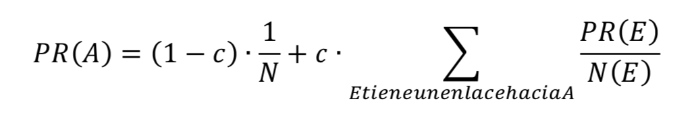

# Buscador
¿Alguna vez te has preguntado por qué los buscadores modernos de información en Internet funcionan tan rápido?

El contenido en la red crece cada día, y sería inviable encontrar información simplemente accediendo, una a una, 
a todas las páginas que existen para ver en cuál se encuentra la información buscada.

En realidad, lo que hacen los buscadores es tener un índice de las páginas que existen. En este índice, 
las palabras más importantes de una página y las palabras que aparecen en ellas están emparejadas, en un sistema clave-valor. 

Buscar información en tablas clave-valor es mucho, mucho más eficiente que buscar por el contenido de cada página. 
Pero la condición es obvia: es necesario crear, desde las páginas, una tabla que represente bien la información. 

Los buscadores hacen esto: tienen grandes equipos de proceso automático que literalmente se “descargan Internet”, crean la tabla, 
y buscan en ella cuando los usuarios escribimos las palabras claves que esperamos que estén en las páginas que buscamos.

Las tablas, sin embargo, son enormes. Si buscamos la palabra “universidad” tendremos tantos resultados que el usuario no sabría cómo navegar por esa información. 
Para hacer la vida del usuario más sencilla, los sistemas que crean y buscan en índices también hacen una estimación de qué páginas son potencialmente más interesantes, 
y ordenan el resultado de la búsqueda haciendo que veamos en primer lugar las más prometedoras.

Hay muchos algoritmos para hacer esto. Uno de los más famosos es el PageRank, que no sólo considera que una página es más importante cuantas más sean las páginas que enlazan a ella, 
sino que los enlaces desde páginas más importantes tienen aún más peso. 
Así, se considera que enlazar a una página la hace más relevante para una búsqueda.

Para ordenar los resultados por importancia, implementamos una versión de PageRank, en la que los archivos más enlazados por otros archivos sean considerados más relevantes.

En la fórmula, llamamos:
  - PR(A) al PageRank de la página A y
  - N(A) al número de enlaces que la página A contiene.
      
          
          
 Dónde 𝑐 es un número real entre 0 y 1, que introduce la posibilidad de que un usuario decida no seguir ningún enlace del archivo en el que se encuentra y elija al azar un archivo entre el resto, 
 los expertos aseguran que un famoso buscador usa el valor 0.85 para la constante 𝑐.
